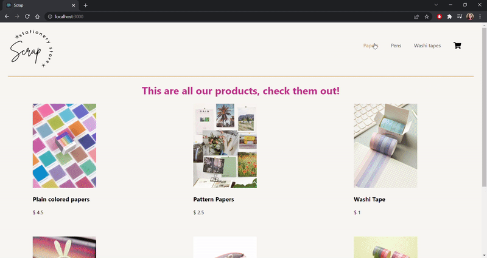

# E-commerce about Scrapbook/Stationery Store

- Scrap is not a normal stationery store. This one's dedicated to 'Scrapbooks'. Scrapbooking is a crafting and documenting activity which involves taking books with blank pages and adding photos, memorabilia, journaling, and embellishments.

- Photos and information were taken from the following links: https://www.shein.co.uk/ - https://www.scrapbook.com/

- Use of Fontawesome for icons since it creates a sofisticated and profesional look to the webpage: https://fontawesome.com/

## For more information

- E-mail: dumraufp@gmail.com
- Twitter @pdumrauf
- [LinkedIn] (https://www.linkedin.com/in/pauladumrauf/)
